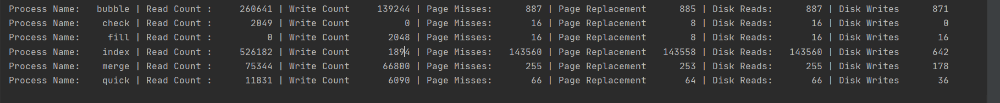

# os-virtual-mem-emulator

A simulation of the virtual memory. Page replacement and allocation algorithms are compared by the number of:
* Reads
* Writes  
* Page misses  
* Page replacements  
* Disk page writes  
* Disk page reads  
```
sortArrays frameSize numPhysical numVirtual pageReplacement allocPolicy pageTablePrintInt diskFileName.dat
```
```frameSize``` is the size of the page frames, ```numPhysical``` is the total number of page frames in the physical memory,
```numVirtual``` is the total number of frames in the virtual address space, pageReplacement is the page replacement algorithm
(**NRU, FIFO, SC, LRU, WSClock**), ```allocPolicy``` is the allocation policy (global or local), ```pageTablePrintInt``` is the interval of memory accesses after which the page table is printed on screen, ```diskFileName.dat``` is the name of the file that keeps the out of memory frames.
For example,
```
sortArrays 12 5 10 LRU local 10000 diskFileName.dat
```
defines a frame size of 2 12 (4096) integers, 2 5 (32) physical frames, 2 10 (1024) virtual frames, uses **LRU** as page replacement
algorithm, local allocation policy, and ```diskFileName.dat``` as the disk file name. In other words, this system has a physical
memory that can hold *4096\*32=131.072* integers and has a virtual memory that can hold *4096\*1024= 4.194.304* integers. This
command prints the page table on the screen at every 10000 memory accesses.


Benchmark parameters are like this:
```
./benchmark phyIntCount
```

```phyIntCount``` is the number of integers in the physical memory in terms of 2's power.
For example:
if ```phyIntCount``` = 14 then for framSize = 1, ```numPhysical``` will be 13. (also ```numVirtual``` is always set to ```numPhysical``` + 4)
```phyIntCount``` = 14 is the parameter required for sorting 16K integers in physical memory and 128K integers in virtual memory.
## Building
```
make
```
## Results and Evaluation
Some stats to compare the algorithms.  

Here index sort causes many misses because index sort changes the target array elements only when the sorted position of each index is known thus the number of writes required would be minimal. Disk reads are very high because locality principles do not apply strongly in the first phase of the algorithm. In the second phase even though the number of writes is minimum, disk writes are very high are done to unrelated places because the initial array given is unsorted. Even though bubble sort has 100 times more number of writes the disk writes are close to each other with index sort. Index sort is maybe more useful when the target array elements are big data structures. 


Let ```w(k,t)``` the working set be the set of pages used by an application in the most recent ```k``` references at time ```t```. We can plot the appoximate working set graph with our utilities when ```t``` is fixed to the finishing moment of the application.  
Here is an example for Merge Sort thread.

The sudden increase in the number of pages is probably because quicksort thread finished early and the remaining pages was given to merge sort thread. 